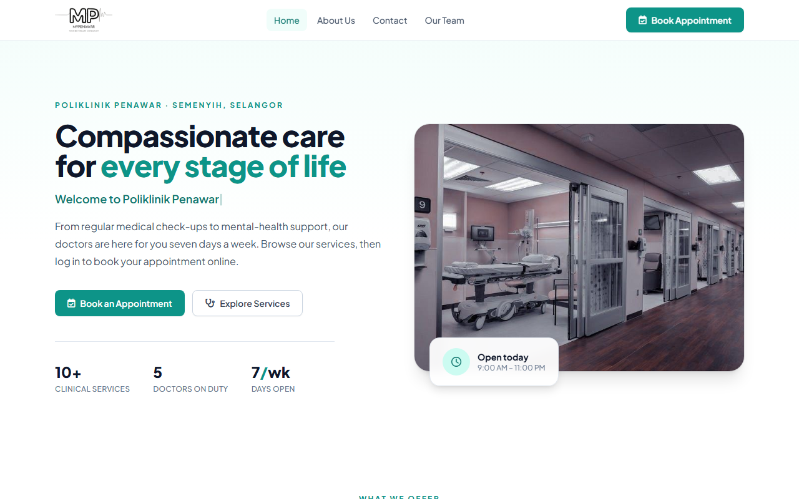
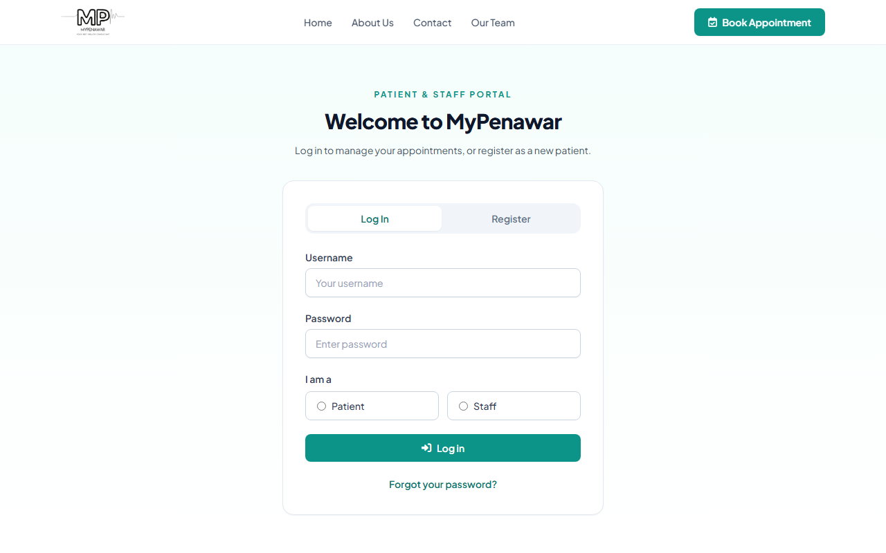
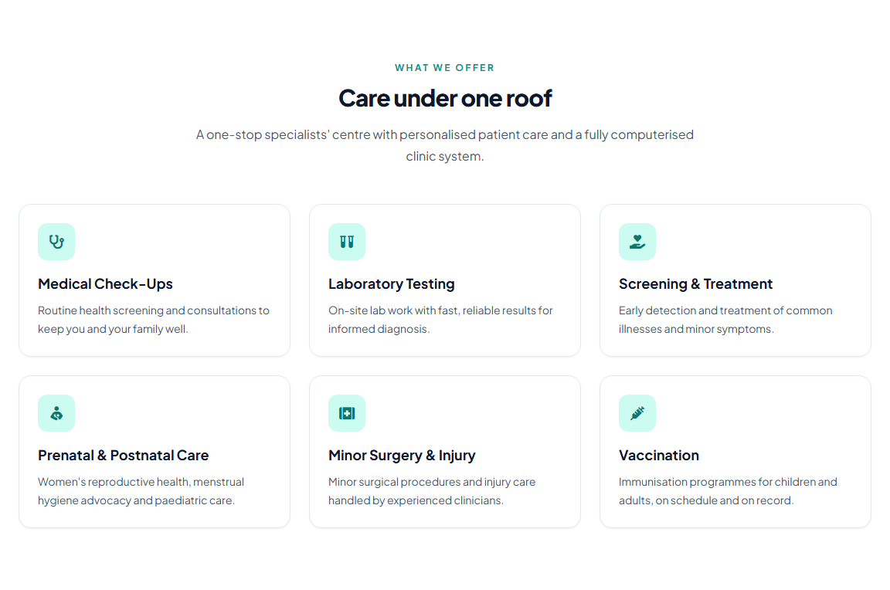
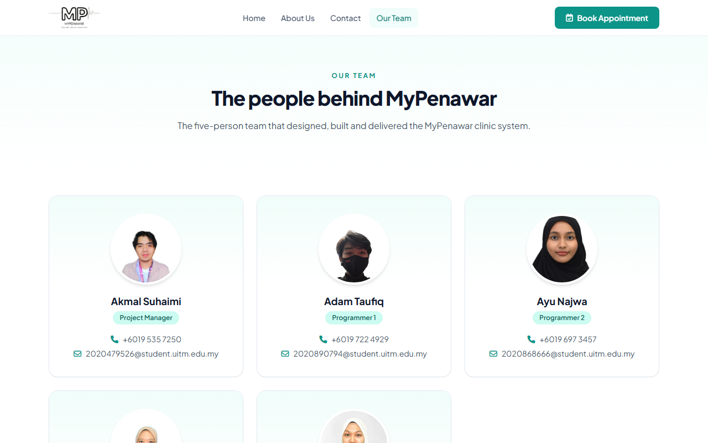
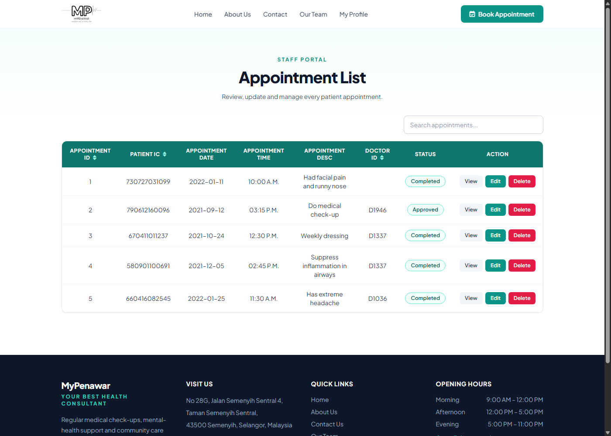

# MyPenawar

A 2022-era plain-PHP + HTML website for "Poliklinik Penawar", a polyclinic in Semenyih,
Selangor. Public pages (home, about us, contact, members) are static HTML; the dynamic
pages — patient/staff login and registration, appointment booking, appointment admin,
monthly reports, receipts, password recovery — are page-per-file PHP scripts using raw
`mysqli` against a MySQL/MariaDB `mypenawar` database (schema + seed data committed in
`mypenawar.sql`). No framework, no composer, no npm.

> **New developer? Start with [`.docs/tldr.md`](.docs/tldr.md)** — every doc summarised on one
> page. The full guide lives in [`.docs/`](.docs/README.md).

| Home (`index.html`) | Login (`login.php`) |
| --- | --- |
|  |  |

| Services (`index.html`) | Our Team (`member.html`) |
| --- | --- |
|  |  |

## About this project

MyPenawar was originally built in 2022 as a final-year university project and published
to GitHub in 2023. In 2026 the UI was modernized into a single Tailwind-CDN design
system (teal/slate clinic look, shared header/nav/footer partials) — the original 2022
design is preserved in git history at the
[pre-facelift commit](https://github.com/dxiiren/my-penawar/tree/921630e69add4d269ab9a0be3c28280eadbdc511).
The backend is intentionally left as submitted — page-per-file raw PHP, string-built
`mysqli` queries, plaintext seed passwords and all — as a snapshot of that stage, not as
an example of current practice. For how the same developer writes PHP today, see the
Laravel 12 repos [job-portal](https://github.com/dxiiren/job-portal) and
[book-review](https://github.com/dxiiren/book-review), which supersede these patterns.

## Prerequisites

| Tool | Version | Installed by |
| --- | --- | --- |
| PowerShell + winget | Windows 10/11 stock | — (the only true prerequisites) |
| Git | any recent | `setup.ps1` |
| PHP | 8.4 (with `mysqli` enabled) | `setup.ps1` |
| uv + Python | latest | `setup.ps1` (used by `.claude` tooling) |
| MariaDB (portable, serves `127.0.0.1:3307`) | 11.4 | `setup.ps1` — extracted to `%LOCALAPPDATA%\Programs\mariadb`, data dir initialised, `mypenawar` imported |
| just | any recent | `setup.ps1` |
| Claude Code CLI | latest | `setup.ps1` (optional, for AI-assisted dev) |

## Quick start

```powershell
# 1. One-time machine setup (idempotent — safe to re-run).
#    Installs everything INCLUDING portable MariaDB and imports mypenawar.sql.
pwsh ./setup.ps1

# 2. Close and reopen PowerShell so PATH updates land

# 3. Start the database, then the dev server (start does NOT auto-start the DB)
just db-start
just start
```

The app is now at **http://127.0.0.1:8112** with every page working — static and
DB-backed. Stop with `just stop` (server) and `just db-stop` (database). Skipping
`just db-start` still gives you the static pages; see
[Demo / local access](#demo--local-access) below.

## Demo / local access

There is no hosted demo — the site runs locally via `just db-start` + `just start`.

**Works with no database at all** (i.e. before `just db-start`):

- Home — <http://127.0.0.1:8112/index.html>
- About us — `/aboutus.html` · Contact — `/contact.html` · Members — `/member.html`
- Login/registration **form** — `/login.php` renders fully; submitting it needs the DB
- Password-recovery form — `/recover_psw.php` (sending the mail needs the DB + SMTP)

**Needs the database (`just db-start`):** everything that touches data — logging in,
patient/staff profiles, appointment booking and admin (`patient booking.php`,
`patient.php`, `patientedit.php`, `code.php`), appointment history (`appList2.php`),
`monthly report.php`, `receipt.php`, `get_data.php`, `reset_psw.php`. With the DB down
these paths return HTTP 200 with a printed `mysqli_sql_exception` instead
([why](#pages-that-touch-the-database-fail)).

**Database setup is automated.** `setup.ps1` extracts a portable MariaDB 11.4 to
`%LOCALAPPDATA%\Programs\mariadb` (no Windows service, no admin rights), initialises
its data directory (root, empty password — exactly what `db_config.php` expects on
port **3307**), and imports `mypenawar.sql`. Day-2 lifecycle is `just db-start` /
`just db-stop`; `just db-seed` re-imports the dump if the `mypenawar` database ever
goes missing.

The dump (phpMyAdmin export, MariaDB 10.4) seeds all five tables — `booking`,
`employee`, `patient`, `payment`, `service` — including ready-made staff and patient
accounts, so you can log in and exercise the booking flow immediately after setup.
The usernames/passwords are in the `employee` and `patient` INSERT rows of
`mypenawar.sql` (plaintext seed data for a local demo DB — deliberately not repeated
here).



## Commands

Run `just` with no arguments to list every recipe. The ones you'll use daily:

| Command | What it does |
| --- | --- |
| `just start` | Start the PHP dev server on http://127.0.0.1:8112 (background window; does NOT start the DB) |
| `just serve` | Same server in the foreground — watch request logs, Ctrl+C to stop |
| `just stop` | Kill only THIS repo's `php.exe` processes |
| `just db-start` | Start portable MariaDB on 127.0.0.1:3307 (pair with `just start` for DB pages) |
| `just db-stop` | Stop MariaDB (graceful shutdown, falls back to killing our `mariadbd.exe`) |
| `just db-seed` | Import `mypenawar.sql` if the `mypenawar` DB is missing (setup.ps1 already did it once) |
| `just lint` | `php -l` syntax-check every PHP file |
| `just test` | HTTP smoke-test suite: lint gate + no-DB pages + auth guard; DB flows when 3307 answers (else SKIP) |
| `just claudex` | Launch Claude Code (Sonnet, all permissions) |

## Testing

`just test` runs [`tests/smoke.ps1`](tests/smoke.ps1) — an HTTP smoke-test suite:

1. **Lint gate** — `php -l` over every `.php` file (same sweep as `just lint`).
2. **HTTP checks** — boots its **own** dev server on a spare port (**8614**, same command
   shape as `just serve`) so it never fights a `just start` server on 8112, then asserts:
   - `/index.html` 200 and non-empty
   - `/aboutus.html` and `/contact.html` 200
   - `/login.php` 200 and rendering the login form
   - `/index.php` 200 (the output-test scratch page)
   - unauthenticated `patient profile.php` → 302 to `login.php`, warning-free
     (the portal auth guard — works with or without the DB)
3. **DB-backed flows** — only when MariaDB answers on `127.0.0.1:3307`
   (`just db-start`): a seeded patient login POST succeeds, the logged-in profile
   page renders the seeded patient row, and the staff appointment list renders
   seeded rows. When the DB is down these print `SKIP` lines instead of failing,
   so the suite is green either way.

Read-only by design even with the DB up: no booking inserts, no `code.php`
updates/deletes — smoke checks must not mutate the seeded database.

One `PASS`/`FAIL`/`SKIP` line per check; exit code 1 if anything fails. The script
always kills the server it started (a `finally` block scoped to this repo's path +
port 8614).

## Troubleshooting

### Pages that touch the database fail

MariaDB is not running (`just db-start`), or the `mypenawar` database is missing
(`just db-seed`). Pages that `require 'db_config.php'` at the top (`patient.php`,
`patientedit.php`, `receipt.php`, `get_data.php`, `code.php`, `reset_psw.php`) return
HTTP 200 whose entire body is an uncaught `mysqli_sql_exception` fatal error
(`display_errors` is on, so PHP prints the error instead of sending 500); pages that
connect mid-page (`login.php`, the booking/report pages) render their HTML and
then print the same exception at the bottom. Since PHP 8.1 `mysqli` throws on failure,
so the legacy `OR DIE("Connection Failed")` guards never run.

### `PHP 8.4 not found at ...\php-8.4\php.exe`

`just` recipes use a pinned PHP at `%LOCALAPPDATA%\Programs\php-8.4\php.exe`. Run
`pwsh ./setup.ps1` to install it, then reopen PowerShell.

### Deprecation warnings printed above pages

Expected. The code was written for PHP ~8.1 (XAMPP, 2022) and runs here on PHP 8.4 with
`display_errors` on (development php.ini). Warnings/deprecations on an otherwise-rendering
page are cosmetic — don't "fix" them by suppressing errors globally.

### Page renders without styling

Tailwind (Play CDN), Google Fonts, Font Awesome, typed.js, and jQuery/jQuery UI load
from CDNs — the site needs internet for full styling. Offline, pages render unstyled
HTML. Expected, not a bug.

More in [`.docs/06-troubleshooting/common-issues.md`](.docs/06-troubleshooting/common-issues.md).

## Project layout

```
my-penawar/
  index.html              # real home page (Tailwind hero + typed.js, services, footer)
  index.php               # PHP output-test scratch page (served for "/" by php -S)
  partials/               # shared head/nav/footer includes for the PHP pages (2026 facelift)
  aboutus.html, contact.html, member.html, demo.html, notification.html, receipt.html
  login.php               # patient/staff login + patient registration
  login2.php, index2.php  # older login variants (index2 queries a nonexistent `staff` table)
  patient profile.php     # patient self-profile view/update    (filename has a space; auth-guarded)
  patient booking.php     # appointment booking form + slot check (space)
  patient.php             # staff: appointment list admin
  patientedit.php         # staff: edit one appointment (posts to code.php)
  code.php                # booking delete/update + payment insert handler
  get_data.php            # AJAX patient lookup by IC
  appList2.php            # patient appointment history (auth-guarded)
  employee profile.php    # staff self-profile view/update (space; auth-guarded)
  monthly report.php      # staff monthly bookings/payments report (space)
  receipt.php             # payment receipt
  recover_psw.php         # email a reset link (PHPMailer)  ·  reset_psw.php — set new password
  message.php             # session flash-message partial
  db_config.php           # mysqli connection (localhost:3307 / mypenawar / root)
  mypenawar.sql           # phpMyAdmin dump: schema + seed data (booking, employee, patient, payment, service)
  Mail/phpmailer/         # vendored PHPMailer 5.x (third-party, do not edit)
  image/                  # logos, staff photos, background
  style.css               # legacy 2022 stylesheet — used only by the dead variants now
  justfile, setup.ps1     # dev recipes (incl. db-start/db-stop/db-seed) + one-time machine setup (incl. portable MariaDB)
  tests/                  # smoke.ps1 — HTTP smoke-test suite; DB flows auto-SKIP when 3307 is down (`just test`)
  docs/images/            # README screenshots (home, login, services, team, appointments)
  .docs/                  # numbered documentation set
  .claude/                # skills, hooks, settings, memory
```
